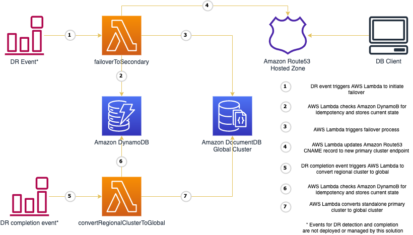

# Global Cluster Automation
The use cases considered for this tool are Disaster Recovery (DR) and Business Continuity Planning (BCP). DR use case is applicable when DocumentDB is unavailable in a region. BCP use case is applicable when you want to switch from one functional region to another to help validate business continuity across various AWS regions.

## Pre-requisite
This tool requires Route53 private hosted zone with at least one CNAME that will be used by the application to write data to Amazon DocumentDB.

## Overview
This tool provides the following AWS Lambda functions to automate the failover process for global clusters. The first two AWS Lambda functions addresses DR use case and the third function addresses BCP use case.

### Architecture - Disaster Recovery


### 1. failoverToSecondary
#### Input
```
{
  "global_cluster_id": "global-demo",
  "secondary_cluster_arn": "arn:aws:rds:us-west-2:123456789123:cluster:cluster-1",
  "primary_cluster_cname": "primary.sample.com",
  "hosted_zone_id": "Z005XXXXYYYYZZZZDOHSB",
  "is_delete_global_cluster": true
}
```
#### Action
This function will remove and promote the secondary cluster provided as input. It will also remove other secondary clusters from the global cluster and delete all of these secondary clusters, including the global cluster, if the `is_delete_global_cluster` is set to True. This function will update the record value for the provided `primary_cluster_cname` and `hosted_zone_id`, to the cluster endpoint of the promoted primary cluster.   
#### Output
Primary cluster in a functional AWS region as indicated by the `secondary_cluster_arn` in the input with the `primary_cluster_cname` pointing to this cluster’s cluster endpoint. 

Note: During a DR scenario, the writes to the cluster will fail until the promotion process is complete. The RTO is typically less than minute and to avoid data loss, it is recommended to implement <a href="https://aws.amazon.com/blogs/database/building-resilient-applications-with-amazon-documentdb-with-mongodb-compatibility-part-2-exception-handling/" target="_blank">exception handling with retry </a>in the application. 

### 2. convertRegionalClusterToGlobal
#### Input
```
{
  "global_cluster_id": "global-demo",
  "primary_cluster_arn": "arn:aws:rds:us-west-2:123456789123:cluster:cluster-1",
  "secondary_clusters": [
    {
      "region": "us-east-2",
      "secondary_cluster_id": "cluster-2",
      "engine_version": "5.0.0",
      "number_of_instances": 3,
      "subnet_group": "default",
      "security_group_id": [
        "sg-XXXXd8725e9edYYYY"
      ],
      "kms_key_id": "arn:aws:kms:us-east2-2:123456789123:key/aaaaaaaa-bbbb-cccc-dddd-eeeeffffjjjj",
      "backup_retention_period": 1,
      "cluster_parameter_group": "default.docdb4.0",
      "preferred_back_up_window": "10:25-10:55",
      "preferred_maintenance_window": "wed:06:40-wed:07:10",
      "storage_encryption": true,
      "deletion_protection": false
    }
  ]
}
```
#### Action
This function will convert the regional cluster provided via input as `primary_cluster_arn` to a global cluster. The cluster indicated by `primary_cluster_arn` will become the primary cluster. The array of secondary clusters provided as input will be created with appropriate number of instances indicated by `number_of_instances`.The instance class for this instance will be the same as the instance class of primary instance in the primary cluster.

#### Output
Global cluster with a primary cluster and secondary cluster(s) in the provided region(s) and subnet(s) 

### Architecture - Business Continuity Planning  


### 3. failoverAndConvertToGlobal
#### Input
```
{
  "global_cluster_id": "global-demo",
  "secondary_cluster_arn": "arn:aws:rds:us-west-2:123456789123:cluster:cluster-1",
  "primary_cluster_cname": "primary.sample.com",
  "hosted_zone_id": "Z005XXXXYYYYZZZZDOHSB"
}
```
#### Action
This function will trigger the lambda function *failoverToSecondary* to remove and promote the provided secondary cluster `secondary_cluster_arn`. The boolean to delete old global cluster is set to True by this function. After successful promotion of secondary cluster, this lambda function will trigger the *failoverAndConvertToGlobal* lambda function to recreate the global cluster with secondary clusters in regions that existed in prior to failover.The secondary clusters will use VPC ID and security group ID that were used prior to failover and the cluster ID will be defined based on the current time stamp and prior cluster ID. The instance size and number of instances will also be the same as before (failover).

Note: During failover to secondary cluster, there will be a brief window of time where the writes to the original primary cluster is not replicated to the newly promoted cluster. Hence, it is always recommended to perform BCP testing during non peak hours when the write traffic is minimum if not zero.

#### Output
Global cluster with primary cluster in the region indicated by the `secondary_cluster_arn` with `primary_cluster_cname` pointing to this cluster’s cluster endpoint and secondary clusters in regions prior to failover. 

## Usage
1. Checkout source code
```
git clone https://github.com/awslabs/amazon-documentdb-tools.git
```
2. Package lambda functions to S3 bucket. Ensure your terminal has access to the AWS account where the S3 bucket resides. Python is a pre-requisite for this step
```
cd amazon-documentdb-tools/global-clusters-automation
./deploy/package_lambda.sh <BUCKET_NAME>
```
3. Deploy Cloud formation template from the below location to your AWS account. Use the bucket from the previous step as parameter in the Cloud Formation template
```
cat deploy/global_clusters_automation.yml
```
4. Navigate to AWS Lambda service and trigger the functions. The JSON payload sample can be found in the test folder of the git repo

## CloudFormation Stack
The Cloud Formation Template (from step 3 above) deploys the three AWS Lambda functions with an IAM Role that has access AWS DynamoDB, Amazon DocumentDB and AWS Lambda to invoke other Lambda functions. The CloudFormation template also creates a DynamoDB table to store the inputs and current state. This table helps to keep the Lambda functions idempotent. 

## Clean up
To remove the components deployed by this tool, delete the CloudFormation stack and the zip files containing source code from S3 bucket.

## Solution Demonstration
https://user-images.githubusercontent.com/10189030/159790184-7fb69643-f2cf-41e1-9a88-6549ac018b98.mp4
